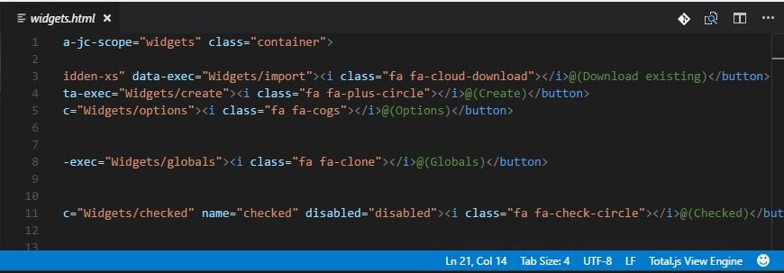

# Total.js Language Support

This extention adds [Total.js](https://www.totaljs.com/) View Engine, Config and Log file syntax Language Support to Visual Studio Code.

## Information
- Using original `.tmLanguage` grammar syntax files found in [Total.js Developer Tools](https://docs.totaljs.com/latest/en.html#pages~Developer%20tools)
- View Engine supports files with extensions `.html`, `.htm`, `.shtml`, `.xhtml`, `.phtml`, `.inc`, `.tmpl`, `.tpl`, `.ctp`, see [Total.js View Engine](https://docs.totaljs.com/latest/en.html#pages~View%20engine) for more information.
- Config supports files named `config`, `config-debug`, `config-release`, `config-test` and extensions `.resource`, `.versions`, `.dependencies`, `.package`, see [Total.js Configuration](https://docs.totaljs.com/latest/en.html#api~FrameworkConfiguration) for more information.
- Log supports files named `*.*-log`

## History
- See [CHANGELOG.md](CHANGELOG.md)